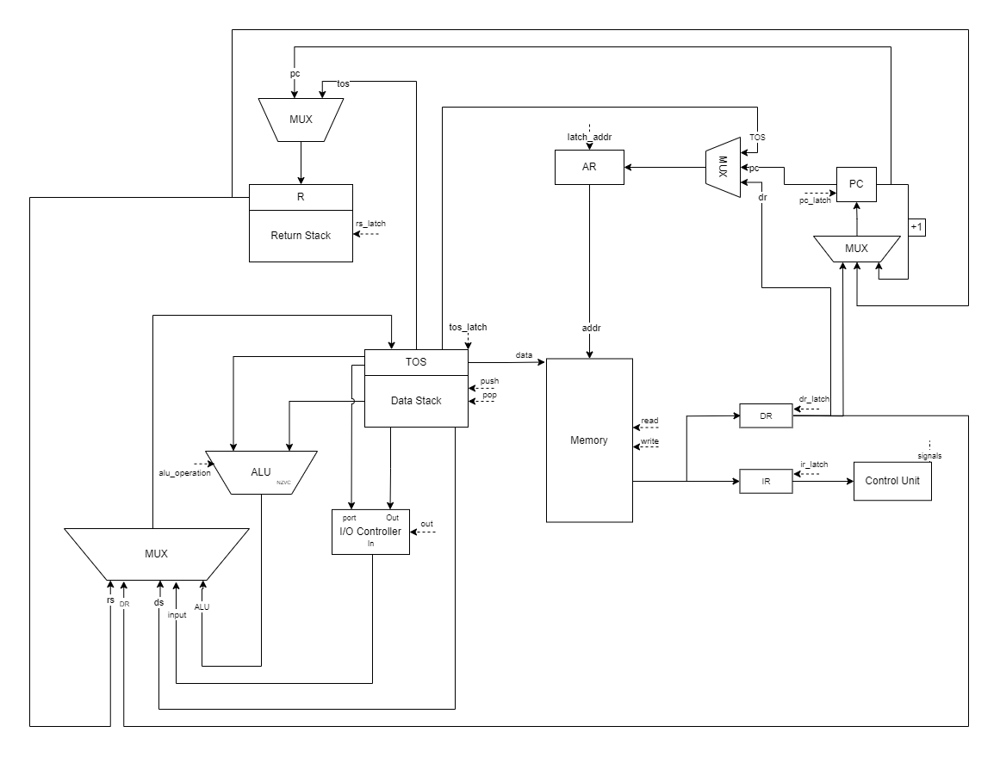
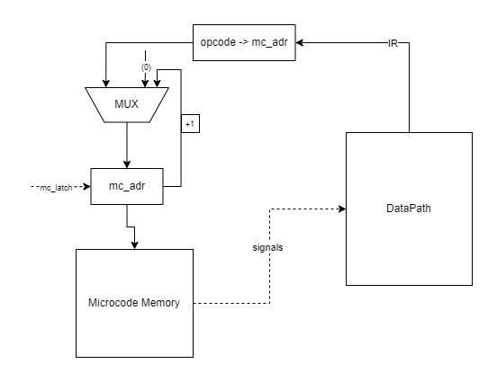

# Лабораторная работа №4 

* **Матвеева Полина Павловна**
* **Р3215**
* **Вариант:** `lisp | stack | neum | mc | tick | binary | stream | port | pstr | prob1 | superscalar`

## Вариант

| Задание | Вариант       | Описание                                                                                                                                                                                                                                               |
| :--- |:--------------|:-------------------------------------------------------------------------------------------------------------------------------------------------------------------------------------------------------------------------------------------------------|
| **Язык программирования** | `lisp`        | **S-expressions**. Программа представляет собой вложенные списки. Поддержка функций, условий и арифметики.                                                                                                                                             |
| **Архитектура** | `stack`       | **Стековая архитектура**. Вычисления выполняются с использованием стека операндов. Доступ к памяти осуществляется через отдельные инструкции.                                                                                                          |
| **Организация памяти** | `neum`        | **Фон Неймановская архитектура**. Физически общие память команд и память данных.                                                                                                                                                                       |
| **Control Unit** | `mc`          | **Microcoded**. В отчёте необходимо задокументировать уровень микроинструкций. Моделирование должно выполняться с точностью до такта. Микрокод должен быть сохранён в отдельной памяти для микропрограмм. Модель процессора должна исполнять микрокод. |
| **Точность модели** | `tick`        | **Потактовое моделирование**. Логирование состояния процессора на каждом такте.                                                                                                                                                                        |
| **Представление кода** | `binary`      | **Бинарный формат**. Транслятор генерирует исполняемый файл в бинарном представлении.                                                                                                                                                                  |
| **Ввод-вывод** | `stream`      | **Поток**. Ввод-вывод осуществляется как поток токенов (как во Wrench)                                                                                                                                                                                 |
| **Ввод-вывод ISA** | `port`        | **Port-mapped I/O**. Использование специальных инструкций (`IN`, `OUT`) для обращения к портам ввода-вывода.                                                                                                                                           |
| **Поддержка строк** | `pstr`        | **Length-prefixed strings**. Строки хранятся как длина строки + сама строка в байтах.                                                                                                                                                                  |
| **Алгоритм** | `prob1`       | **Largest Palindrome Product**. Euler problem 4 [link](https://projecteuler.net/problem=4)                                                                                                                                                             |
| **Усложнение** | `superscalar` | **Суперскалярная организация**. Возможность параллельного исполнения нескольких инструкций за такт при отсутствии зависимостей.                                                                                                                        |

---

## Язык программирования

---

### Форма Бэкуса-Наура

```ebnf
program      ::= s_expr+

s_expr       ::= atom | form
atom         ::= INT_LIT | STR_LIT | IDENT
form         ::= "(" ( arith | compare | var | set | if | while
                     | def | call | io | array_op | addc ) ")"

arith        ::= arith_op s_expr s_expr
arith_op     ::= "+" | "-" | "*" | "/" | "%"
compare      ::= compare_op s_expr s_expr
compare_op   ::= "=" | "!=" | "<" | ">"

var          ::= "var" IDENT s_expr
               | "var" IDENT "(" "array" INT_LIT ")"
set          ::= "set" IDENT s_expr
array_op     ::= "aref" IDENT s_expr            
               | "aset" IDENT s_expr s_expr     
addc         ::= "addc" s_expr s_expr           

if           ::= "if" s_expr s_expr s_expr  
while        ::= "while" s_expr s_expr+          

def          ::= "def" IDENT "(" IDENT ")" s_expr+   
call         ::= "call" IDENT s_expr                 

io           ::= "print" s_expr | "read" | "read_str" | "len" s_expr

INT_LIT      ::= "-"? DIGIT+
STR_LIT      ::= '"' CHAR* '"'
IDENT        ::= LETTER ( LETTER | DIGIT | "_" )*
DIGIT        ::= "0" … "9"
LETTER       ::= "a" … "z" | "A" … "Z"
CHAR         ::= любой символ, кроме '"'
COMMENT      ::= ";" { любой символ } <конец строки>
```

### Семантика

**Стратегия вычислений** -- аппликативная (applicative order): аргументы формы вычисляются слева направо, затем применяется операция. Арифметика и сравнения строго бинарны, поэтому сумму трёх чисел записывают как `(+ 1 (+ 2 3))`

**Выражения и значения** -- любое выражение возвращает значение, поэтому форму можно подставить аргументом в другую форму: `(print (if (= x 1) 10 20))`, `(set x (if p 1 2))`, `(print (set y 13))`. Значение  у `def` и `while` -- значение последнего вычисленного выражения

**Точка входа** -- выполнение начинается с первого выражения верхнего уровня, не являющегося объявлением функции (`def`). Сами `def` только регистрируют функции

**Области видимости** -- единое плоское пространство имён:
- параметр функции локален
- переменные (`var`) глобальные -- размещаются в общей памяти и видны в любом месте программы
- обращение к ещё не объявленному имени -- ошибка трансляции
- имена чувствительны к регистру и имя переменной не может совпадать с именем функции

**Типизация и литералы** -- значение в рантайме всегда машинное слово (32-битное знаковое целое). Логического типа нет: в условиях `0` -- ложь, любое ненулевое -- истина, а сравнения возвращают `1`/`0`. Литералы:
- целочисленный -- десятичный, допускается знак `-`
- строковый -- `".."`; размещается в статической памяти в формате `pstr` (байт длины + байты самих символов), значением литерала является адрес строки


**Формы:**
- `(var name expr)` -- объявить переменную с начальным значением (на примере с массивом: `(var name (array N))` -- выделить массив из `N` целых)
- `(set name expr)` -- присвоить значение объявленной переменной
- `(if cond then else)` -- условие - если выполняется - если нет
- `(while cond body...)` -- повторять тело, пока условие истинно
- `(def name (param) body...)` -- инициализация функции с одним параметром
- `(call name arg)` -- вызвать функцию
- `(aref arr i)` / `(aset arr i v)` -- чтение/запись `i`-го элемента массива;
- `(print expr)` -- вывести число или строку
- `(read)` -- прочитать одно число из потока ввода
- `(read_str)` -- прочитать строку в формате `pstr`: сначала токен длины, затем столько символов (возвращщает адрес строки)
- `(len s)` -- длина строки;
- `(addc a b)` -- сложение с переносом: `a + b + C`; выставляет новый флаг переноса `C`. Обычные `+`/`*` флаг `C` не трогают, поэтому `addc` цепочкой переносит разряд между словами (длинная арифметика, см. `double_arith`)
- арифметика `(+ - * / %)` -- над целыми; сравнения `(> < = !=)` -- результат `1`/`0` .

# Память

## Организация памяти

Архитектура — фон-Нейман: команды и статические данные лежат в **единой байтоадресуемой памяти**. Стек данных и стек возвратов вынесены в отдельные аппаратные стековые памяти.

- Машинное слово — **32 бита**, знаковое (отриц - в доп коде), хранится **little-endian**.
- Адресация — **байтовая**; слово, как и написано выше, занимает 4 последовательных байта.
- Память однопортовая, размер — 65536 байт.
- Ввод-вывод — **порт-ориентированный** (`IN`/`OUT`), в память не отображён: порт `0` — ввод, порт `1` — вывод.

### Регистры

Программно доступны только оба стека через `PUSH/POP/PUSHC/DUP/DROP/SWAP`, арифметику, `CALL/RET`. Остальные регистры служебные и обновляются микрокодом.

| Регистр      | Назначение                                               |
|:-------------|:---------------------------------------------------------|
| `PC`         | счётчик инструкций (байтовый адрес следующей инструкции) |
| `AR`         | адресный регистр для входа в память (из `PC`/`TOS`/`DR`) |
| `IR`         | регистр инструкции — хранит байт опкода                  |
| `DR`         | регистр данных для операнда/значений из памяти, 4 байта  |
| `TOS`        | вершина стека данных                                     |
| `Z`, `N`, `C` | флаги нуля, знака и переноса. `Z`/`N` обновляются каждой операцией АЛУ; `C` (перенос из старшего разряда) изменяется **только** командой `ADC` и используется ею как входящий перенос — обычные `ADD`/`MUL` его не трогают |

Аппаратные стеки: **стек данных** (операнды выражений, аргументы; вершина в `TOS`) и **стек возвратов** (адреса возврата `CALL`/`RET`, сохранение параметра `TORS`/`FROMRS`, счётчик цикла `NEXT`).

### Карта памяти

```text
  0x0000  +-----------------------------------------------+
          | код верхнего уровня (тело программы)           |
          | HALT                                          |
          | тела функций (каждое заканчивается RET)        |
          | __print_str / __read_str (служебные п/п)      |
          +-----------------------------------------------+
  0x0F00  | PARAM_ADDR - слот текущего параметра функции   |
  0x0F04  | PTR_ADDR   - указатель чтения строки           |
  0x0F08  | BUF_ADDR   - база строкового буфера            |
          +-----------------------------------------------+
  0x1000  | переменные и массивы (по 4 байта на слот)      |
          +-----------------------------------------------+
  0x2000  | строковые литералы (pstr: длина + символы)     |
          +-----------------------------------------------+
  0x3000  | буферы ввода строк (read_str)                  |
          +-----------------------------------------------+
```

### Размещение программы и данных

**Инструкции** укладываются с адреса `0x0000`: сначала код верхнего уровня, затем `HALT`, далее тела функций и служебные подпрограммы. Первой исполняется первая инструкция тела программы (отдельного перехода на `main` нет — функции достижимы только через `CALL`). Адреса переходов/вызовов доразрешаются после генерации.

**Константы** Целое значение всегда помещается в 32-битный операнд, поэтому числовой литерал кодируется немедленно — `PUSHC <val>`, без отдельной ячейки. Строки размещаются в секции данных, в код идёт `PUSHC <адрес строки>`.

**Строки** Хранятся от `0x2000`: первый байт — длина, далее байты символов. Значение строки — адрес её первого байта; `len` читает длину из префикса.

**Переменные.** Каждая `var` получает слово (4 байта) в области `0x1000+`. Чтение — `PUSH <addr>`, запись — `POP <addr>`.

**Массивы.** `(var a (array N))` резервирует `N` подряд идущих слов в той же области; значение переменной-массива — её базовый адрес. `(aref a i)` вычисляет `base + i*4` и делает `LOAD`; `(aset a i v)` — `STORE`.

**Функции и параметры.** Тела функций лежат после `HALT`. Параметр хранится в единственном слоте `PARAM_ADDR`: пролог сохраняет прежнее значение параметра в стек возвратов (`TORS`) и кладёт в слот аргумент, эпилог восстанавливает (`FROMRS`) — поэтому и работает рекурсия. Аргумент передаётся через стек данных, затем `CALL`.


# Система Команд

## Формат инструкции

Кодирование **переменной длины**: один байт опкода и, для части команд, 4-байтный операнд (little-endian, знаковый). Это не фиксированные 32 бита.

```text
Без операнда (1 байт) — ADD, SUB, MUL, DIV, MOD, AND, OR, NOT, NEG, INC,
SWAP, CMP, DUP, DROP, IN, OUT, TORS, FROMRS, LOAD, STORE, ADC, RET, HALT:

  +-------+
  | опкод |   1 байт 
  +-------+

С операндом 5 байт — PUSH, POP, PUSHC, JMP, JZ, JN, CALL, NEXT:

  +-------+----+----+----+----+
  | опкод | b0 | b1 | b2 | b3 |
  +-------+----+----+----+----+
            
```

Смысл операнда зависит от команды: `PUSHC` — константа, `PUSH`/`POP` — адрес данных, `JMP`/`JZ`/`JN`/`CALL`/`NEXT` — адрес кода. В `IN`/`OUT` номер порта берётся с вершины стека, операнда у них нет.

**Как это лежит в памяти.** `PUSHC 1231` (опкод `0x03`, `1231 = 0x000004CF`):

```text
адрес:  00   01   02   03   04
байт:   03   cf   04   00   00
```
 
| Мнемоника | Опкод (hex / bin) | Операнд | Такты | Действие |
| :-- | :-- | :-- | :-: | :-- |
| `HALT` | `00` / `00000` | — | 1 | остановка |
| `PUSH` | `01` / `00001` | адрес | 3 | `TOS ← [addr]` |
| `POP` | `02` / `00010` | адрес | 3 | `[addr] ← TOS` |
| `PUSHC` | `03` / `00011` | константа | 2 | положить константу на стек |
| `ADD` | `04` / `00100` | — | 1 | `NOS + TOS` |
| `SUB` | `05` / `00101` | — | 1 | `NOS - TOS` |
| `MUL` | `06` / `00110` | — | 1 | `NOS * TOS` |
| `DIV` | `07` / `00111` | — | 1 | `NOS / TOS` (целочисленно) |
| `AND` | `08` / `01000` | — | 1 | поразрядное И |
| `OR` | `09` / `01001` | — | 1 | поразрядное ИЛИ |
| `NOT` | `0A` / `01010` | — | 1 | поразрядная инверсия TOS |
| `MOD` | `0B` / `01011` | — | 1 | `NOS % TOS` |
| `INC` | `0C` / `01100` | — | — | `TOS + 1` (зарезервирована, см. ниже) |
| `NEG` | `0D` / `01101` | — | 1 | `-TOS` |
| `SWAP` | `0E` / `01110` | — | 3 | обмен TOS и NOS |
| `CMP` | `0F` / `01111` | — | 1 | сравнение, флаги Z/N (стек не меняет) |
| `JMP` | `10` / `10000` | адрес | 2 | безусловный переход |
| `JZ` | `11` / `10001` | адрес | 2 | переход, если Z = 1 |
| `JN` | `12` / `10010` | адрес | 2 | переход, если N = 1 |
| `IN` | `13` / `10011` | — | 1 | ввод с порта (номер порта на TOS) |
| `OUT` | `14` / `10100` | — | 2 | вывод в порт (порт на TOS, значение в NOS) |
| `DUP` | `15` / `10101` | — | 1 | дублировать TOS |
| `DROP` | `16` / `10110` | — | 1 | снять TOS |
| `CALL` | `17` / `10111` | адрес | 3 | вызов функции (адрес возврата → стек возвратов) |
| `RET` | `18` / `11000` | — | 1 | возврат из функции |
| `NEXT` | `19` / `11001` | адрес | 2 | декремент счётчика на стеке возвратов, переход, пока ≠ 0 |
| `TORS` | `1A` / `11010` | — | 1 | `TOS` → стек возвратов |
| `FROMRS` | `1B` / `11011` | — | 1 | стек возвратов → `TOS` |
| `LOAD` | `1C` / `11100` | — | 1 | `TOS ← [TOS]` |
| `STORE` | `1D` / `11101` | — | 2 | `[TOS] ← NOS` |
| `ADC` | `1E` / `11110` | — | 1 | `NOS + TOS + C`, выставляет новый перенос `C` |

**Такты.** Одна микрокоманда = один такт; в столбце «Такты» — собственное исполнение команды (число её микрошагов). `INC` (`0x0C`) зарезервирована: операция есть в АЛУ, но микрокода и генерации для неё нет. Выборка следующей команды (FETCH, 1 такт) у большинства команд совмещена с их последним тактом (**префетч**) и отдельно не тратится — отдельный такт выборки возникает только после `JMP`/`JZ`/`JN`/`CALL`/`RET`/`NEXT` и `LOAD`/`STORE`.


# Транслятор

## Интерфейс командной строки

```text
python translate.py <source.lisp> <output.bin> [--debug <dump.txt>]
python machine.py   <output.bin> [<input.txt>] [--log <trace.log>] [--limit N]
```

- `translate.py` транслирует исходник в бинарный образ `<output.bin>` и рядом пишет отладочный листинг `<output.bin>.dbg` вида `<address> - <HEXCODE> - <mnemonic>` (путь можно задать через `--debug`).
- `machine.py` исполняет образ. Без `<input.txt>` поток ввода пуст; без `--log` журнал состояний не пишется (быстрее — актуально для `prob1` на миллионы тактов); `--limit` ограничивает число тактов (по умолчанию 10 000 000).

Формат файла ввода — поток токенов через пробел: целые числа и/или строки в кавычках (`"world"` разворачивается в длину + коды символов, формат `pstr`).

## Этапы

```text
src -> tokenize -> parse -> lint -> codegen -> build_memory -> <output.bin>
```

- **`tokenize`** (`translator/parser.py`) — лексер. Токены: `LEFT` `(`, `RIGHT` `)`, `NUMBER`, `STRING`, `SYMBOL`. Пробелы и комментарии (`;` до конца строки) отбрасываются здесь же.
- **`parse`** (`translator/parser.py`) — рекурсивный спуск, строит AST из узлов (`translator/nodes.py`). Дерево человекочитаемо и печатается как `out_ast` в golden-тестах. Здесь же проверяются арности форм (`if` — ровно 3 аргумента, `def` — один параметр и т.п.).
- **`lint`** (`translator/linter.py`) — статический анализ и распределение памяти. Проверяется:
  - обращение к необъявленной переменной / неизвестной функции;
  - `set` по необъявленной переменной;
  - повторное объявление переменной, конфликт имён переменной и функции;
  - `def` — только на верхнем уровне, ровно один параметр;
  - `array` допустим только как инициализатор `var`; цель `aref`/`aset` — массив.

  Здесь же распределяются адреса: переменные и массивы — с `0x1000` (по 4 байта на слот, массив — `N` слотов), строковые литералы — с `0x2000`. Дополнительно выводится лёгкий тип (`int` / `str` / `array`).
- **`codegen`** (`translator/codegen.py`) — обход AST и генерация байт-кода:
  - вложенные выражения раскладываются на стек постфиксным обходом: операнды кладутся на стек, операция берёт вершину;
  - переходы и вызовы вперёд сначала кодируются с пустым операндом, после генерации адреса доразрешаются (`call_fixups` + `patch`);
  - сравнения — `CMP` плюс условный переход, материализующий `0`/`1` на стеке;
  - работа со строками (`print` строки, `read_str`) вынесена в служебные подпрограммы `__print_str` / `__read_str`, дописываемые в конец кода.
- **`build_memory`** (`translator/codegen.py`) — укладывает код с адреса `0x0000` и строковые литералы (`pstr`) по их адресам, формируя итоговый образ памяти.

## Структура бинарного файла

`<output.bin>` — это образ памяти:

- код с `0x0000` — инструкции **переменной длины** (1 байт опкода либо опкод + 4-байтный операнд little-endian; см. [«Формат инструкции»](#формат-инструкции));
- строковые литералы с `0x2000` (`pstr`: байт длины + байты символов).

Хвостовые нули обрезаются (но не короче кода). При загрузке `machine.py` копирует образ в память с адреса `0`. Рядом `translate.py` кладёт текстовый дизассемблерный листинг `<output.bin>.dbg`.

## Модель процессора

- Стековая архитектура (стек данных + стек возвратов).
- Фон-Неймановская память, байтовая адресация, потактовое моделирование.
- Порт-ориентированный ввод-вывод (`IN`/`OUT`, порты 0/1).
- Микропрограммное устройство управления (отдельная память микрокоманд, см. [«Память микрокоманд»](#память-микрокоманд)).

### DataPath


Регистры — защёлки, обновляемые в рамках одного такта набором управляющих сигналов из текущей микрокоманды:

- **PC** — счётчик инструкций; источники: `PCLatch.INC` (+1 байт, после fetch опкода), `PCLatch.INC4` (+4 байта, после fetch операнда), `PCLatch.DR` (←DR, используется при JMP/JZ/JN/CALL/NEXT), `PCLatch.RS` (pop стека возвратов, при RET).
- **AR** — адресный регистр, подаётся на адресный вход памяти; `ARLatch.PC` (←PC), `ARLatch.TOS` (←TOS, при LOAD/STORE), `ARLatch.DR` (←DR, при PUSH/POP по адресу в DR).
- **IR** — регистр инструкции, хранит байт опкода; `IRLatch.MEM` (IR←memory.data_out, 1 такт).
- **DR** — регистр данных, буфер между шиной памяти и остальными блоками; `DRLatch.MEM` (DR←memory.data_out, 4 байта little-endian signed).
- **TOS** — вершина стека данных, явный регистр; источники: `TOSLatch.NOS` (pop из стека данных), `TOSLatch.ALU` (←результат АЛУ), `TOSLatch.DR` (←DR), `TOSLatch.RS` (pop стека возвратов), `TOSLatch.INPUT` (прочитать из порта с номером TOS).

Ниже TOS находится **стек данных** — список слов. `NOSLatch.TOS` — протолкнуть текущий TOS в стек данных; `NOSLatch.RS` — переместить значение с вершины стека возвратов в стек данных.

**Стек возвратов** — отдельный список слов. `RSLatch.PC` — сохранить PC (адрес возврата при CALL); `RSLatch.TOS` — сохранить TOS (при TORS или SWAP).

**АЛУ** принимает для бинарных операций первым операндом NOS (peek стека данных), вторым — TOS; после вычисления NOS выталкивается. Для унарных (`NOT`, `NEG`) оба источника — TOS. Флаги `Z` (ноль) и `N` (отрицательный знаковый бит) обновляются после каждой операции. Флаг `C` (перенос) меняется **только** командой `ADC`: она вычисляет `NOS + TOS + C` и выставляет новый перенос (если беззнаковая сумма не поместилась в 32 бита). Обычные `ADD`/`MUL` флаг `C` не трогают, поэтому он переживает промежуточные вычисления — на этом построена длинная арифметика. `CMP` выставляет `Z`/`N`, не изменяя стека. Операции: `ADD ADC SUB MUL DIV MOD AND OR NOT NEG CMP INC`.

**Память** — 65 536 байт, байтовая адресация, little-endian. `MEMSignal.READ_BYTE` — прочитать 1 байт по AR в data_out (используется при fetch опкода). `MEMSignal.READ_WORD` — прочитать 4 байта по AR в data_out (fetch операнда, LOAD). `MEMSignal.WRITE_WORD` — записать TOS по AR (STORE, POP).

**Ввод-вывод** — порт-ориентированный, подключается через `IOController`. `IOLatch.OUT` — вытолкнуть NOS и отправить в порт TOS; `TOSLatch.INPUT` — прочитать из порта TOS обратно в TOS. Порт `0` — входной поток токенов, порт `1` — выходной поток.

### Control Unit


Устройство управления — микропрограммное. Хранит адрес текущей микрокоманды `mc_adr` и на каждом такте читает из массива `microcode[mc_adr]` закодированное 27-битное слово сигналов.

**Выполнение такта** (`execute_micro`): слово декодируется функцией `decode_mc` в список активных сигналов, все сигналы исполняются за один такт в порядке полей таблицы, затем `tick += 1`. Специальный сигнал `PROG.HALT` генерирует исключение `StopIteration` — симуляция завершается.

**Управление адресом микрокоманды** — поле `MCAdrLatch` в каждом слове:
- `MCAdrLatch.INC` — перейти к следующему микрошагу (`mc_adr += 1`);
- `MCAdrLatch.ZERO` — вернуться к шагу 0 (общий FETCH) — используется после инструкций, меняющих PC или занимающих шину памяти;
- `MCAdrLatch.INPUT` — **диспетчер**: декодировать опкод из IR в индекс первого микрошага через `op2microcode(IR)` (комбинационная таблица), перейти на него, `instruction_count += 1`.

**Префетч** (`FETCH_TAIL`): в последнем микрошаге большинства инструкций вместо `MCAdrLatch.ZERO` одновременно активируются `ARLatch.PC, MEMSignal.READ_BYTE, IRLatch.MEM, PCLatch.INC, MCAdrLatch.INPUT` — fetch опкода следующей инструкции совмещается с последним тактом текущей. Отдельный FETCH-такт возникает только после команд, изменяющих PC непосредственно перед завершением (`JMP/JZ/JN/CALL/RET/NEXT`), и после `LOAD/STORE`, занимающих шину памяти в последнем шаге.

### I/O

Ввод-вывод — **потоковый, порт-ориентированный**. К `IOController` подключаются устройства `IOUnit`, каждое с буфером ввода и буфером вывода.

- **Ввод** (`IN`): номер порта — TOS; значение из буфера помещается обратно в TOS. Пустой буфер генерирует `OSError` — симуляция завершается штатно.
- **Вывод** (`OUT`): номер порта — TOS; выводимое значение — NOS; оба снимаются со стека.

Формат файла ввода (`machine.py`) — поток токенов через пробелы: целые числа и строки в кавычках (строка `"abc"` разворачивается в токены `3 97 98 99`, формат pstr).

### Память микрокоманд

Микрокоманда -- 27-битное целое, кодируется функцией `encode_mc` (`microcode.py`). Каждое поле соответствует одному управляющему сигналу; нулевое значение означает «сигнал не активен».

| Биты  | Ширина | Поле          | Значения (ненулевые)                                                         |
|------:|:------:|:--------------|:-----------------------------------------------------------------------------|
| 26–25 | 2      | `MCAdrLatch`  | 1 = ZERO (→шаг FETCH), 2=INC (+1), 3=INPUT (диспетчер)                       |
| 24    | 1      | `PROG`        | 1 = HALT                                                                     |
| 23–22 | 2      | `RSLatch`     | 1 = PC→RS, 2= TOS→RS                                                         |
| 21–20 | 2      | `ARLatch`     | 1 = PC, 2=TOS, 3=DR                                                          |
| 19–18 | 2      | `MEMSignal`   | 1 = READ_BYTE, 2=READ_WORD, 3=WRITE_WORD                                     |
| 17    | 1      | `IRLatch`     | 1 = MEM                                                                      |
| 16    | 1      | `DRLatch`     | 1 = MEM                                                                      |
| 15–14 | 2      | `NOSLatch`    | 1=TOS (push TOS в стек данных), 2=RS (push RS в стек данных)                 |
| 13–10 | 4      | `ALU_OP`      | ADD=1, SUB=2, MUL=3, DIV=4, AND=5, OR=6, NOT=7, NEG=8, INC=9, MOD=10, CMP=11, ADC=12 |
| 9–7   | 3      | `TOSLatch`    | 1=INPUT (от порта), 2=NOS (pop), 3=ALU, 4=DR, 5=RS (pop)                     |
| 6     | 1      | `IOLatch`     | 1=OUT (NOS → порт[TOS])                                                      |
| 5–3   | 3      | `PCLatch`     | 1=INC (+1), 2=INC4 (+4), 3=DR, 4=RS (pop)                                    |
| 2–0   | 3      | `JUMP`        | 1=JMP, 2=JZ (если Z=1), 3=JN (если N=1), 4=NEXT (цикл NEXT)                  |

Пример -- микрошаг `ADD` (шаг 9): `ALU_OP.ADD` + `TOSLatch.ALU` + `FETCH_TAIL` кодируются в одно слово; АЛУ считает сумму, результат защёлкивается в TOS и одновременно читается опкод следующей инструкции.

## Тестирование

### Golden-тесты

Тесты находятся в `experiment/golden/`. Каждый YAML-файл содержит:

| Поле           | Описание |
|:---------------|:---------|
| `in_source`    | исходный код на Lisp |
| `in_buffer`    | входные токены (список целых и/или строк) |
| `in_limit`     | лимит тактов симуляции |
| `out_stdout`   | сводка прогона: число тактов и инструкций + вывод в форматах hex / num / text |
| `out_ast`      | ожидаемое AST-дерево (текст) |
| `out_code_hex` | ожидаемый дизассемблерный листинг (адрес — байты — мнемоника) |
| `out_log`      | ожидаемый фрагмент журнала состояний |

Запуск:

```bash
pytest experiment/golden.py -v          # проверить все эталоны
pytest experiment/golden.py --regen     # пересоздать эталоны из текущего вывода
```

### Перечень golden-тестов

| Файл                | Описание                                                                |
|:--------------------|:------------------------------------------------------------------------|
| [hello.yaml](experiment/golden/hello.yaml)                | `(print "Hello, Polina Kolomoec!")` — вывод строки                      |
| [cat.yaml](experiment/golden/cat.yaml)                    | чтение строки (`read_str`), вывод, переприсваивание строкового литерала  |
| [hello_user_name.yaml](experiment/golden/hello_user_name.yaml) | диалог: приветствие с именем пользователя                          |
| [sort.yaml](experiment/golden/sort.yaml)                  | пузырьковая сортировка массива чисел из ввода                           |
| [double_arith.yaml](experiment/golden/double_arith.yaml)  | 64-битное сложение: 2×32-битные лимбы, перенос через флаг `C` и команду `addc` |
| [expr.yaml](experiment/golden/expr.yaml)                  | выражения как значения (`set` и `if` возвращают результат)              |
| [factorial.yaml](experiment/golden/factorial.yaml)        | рекурсивный факториал — проверка вызовов `call`/`ret`                  |
| [prob1.yaml](experiment/golden/prob1.yaml)                | Euler Problem 4: наибольшее палиндромное произведение двух трёхзначных  |

**Длинная арифметика и флаг `C`.** Машинное слово 32-битное, поэтому число шире 32 бит хранят как пару лимбов (младший + старший) в обычных переменных и складывают «в столбик», как многозначные числа. `double_arith` складывает `0x2_FFFFFFFF + 0x3_00000001` (вход `[4294967295, 2, 1, 3]` — это `a_lo, a_hi, b_lo, b_hi`):

```text
             старший      младший
   A            2        FFFFFFFF
   B            3        00000001
                         ─────────
 младшие:  FFFFFFFF + 1 = 1 00000000   → пишем 00000000, перенос C = 1   (как 9 + 1 = 10)
 старшие:  2 + 3 + C(1) = 6
                         ─────────
   r            6        00000000      = 0x6_00000000
```

Команда `addc` (`a + b + C`) сама прибавляет входящий перенос и выставляет новый `C`. Младший `addc` идёт при `C = 0` (флаг обнулён при старте), его перенос остаётся в `C` и автоматически попадает в старший `addc`; обычные `+`/`*` флаг не трогают, поэтому он доживает между лимбами. Вывод `[0, 6]` = `[младший, старший]`.

> **Про знак.** Слово в этой машине знаковое, и `0xFFFFFFFF` как знаковое число — это `−1`. Но это одни и те же биты `FF FF FF FF`: в длинной арифметике лимбы читаются как **беззнаковые** группы битов, а перенос АЛУ считает по беззнаковому переполнению — `(a & 0xFFFFFFFF) + (b & 0xFFFFFFFF) > 0xFFFFFFFF` — ровно как флаг `C` в настоящем процессоре. Поэтому `0xFFFFFFFF + 1` даёт младшие биты `0` и перенос `1`. (Само `−1` нигде не печатается — на выход идут только `r_lo = 0` и `r_hi = 6`.)

### Пример запуска

```bash
# program.lisp — свой исходник, например: (print "Hello, world")
python experiment/translate.py program.lisp hello.bin
python experiment/machine.py hello.bin
```

Фрагмент журнала состояний (`--log`):

```text
TICK:      0 | PC:    1 | AR:     0 | mc: 1 | mc=0x6160008 | IR:PUSHC  | DR:          0 | TOS:          0 | Z:0 N:0 C:0 | DS:[0]                          | RS:[]
TICK:      1 | PC:    5 | AR:     1 | mc: 2 | mc=0x4190010 | IR:PUSHC  | DR:       8192 | TOS:          0 | Z:0 N:0 C:0 | DS:[0]                          | RS:[]
TICK:      2 | PC:    6 | AR:     5 | mc:31 | mc=0x6164208 | IR:CALL   | DR:       8192 | TOS:       8192 | Z:0 N:0 C:0 | DS:[0, 8192]                    | RS:[]
TICK:      3 | PC:   10 | AR:     6 | mc:32 | mc=0x4190010 | IR:CALL   | DR:         12 | TOS:       8192 | Z:0 N:0 C:0 | DS:[0, 8192]                    | RS:[]
TICK:      4 | PC:   10 | AR:     6 | mc:33 | mc=0x4400000 | IR:CALL   | DR:         12 | TOS:       8192 | Z:0 N:0 C:0 | DS:[0, 8192]                    | RS:[10]
TICK:      5 | PC:   12 | AR:     6 | mc: 0 | mc=0x2000001 | IR:CALL   | DR:         12 | TOS:       8192 | Z:0 N:0 C:0 | DS:[0, 8192]                    | RS:[10]
TICK:      6 | PC:   13 | AR:    12 | mc:18 | mc=0x6160008 | IR:DUP    | DR:         12 | TOS:       8192 | Z:0 N:0 C:0 | DS:[0, 8192]                    | RS:[10]
TICK:      7 | PC:   14 | AR:    13 | mc:18 | mc=0x6164008 | IR:DUP    | DR:         12 | TOS:       8192 | Z:0 N:0 C:0 | DS:[0, 8192, 8192]              | RS:[10]
```

Поля: `TICK` — счётчик тактов; `mc` — адрес текущей микрокоманды и её значение; `IR` — имя опкода; `DR`, `TOS` — вершина стека; `Z`, `N` — флаги АЛУ; `DS` — верхние элементы стека данных; `RS` — стек возвратов; список сигналов в квадратных скобках.

CI (GitHub Actions, `.github/workflows/ci.yml`) запускает `ruff check`, `mypy` и `pytest experiment/golden.py -v` на каждый push и pull request.
